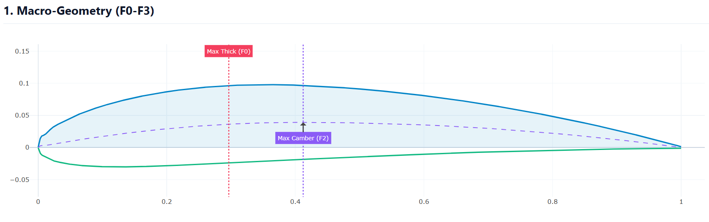
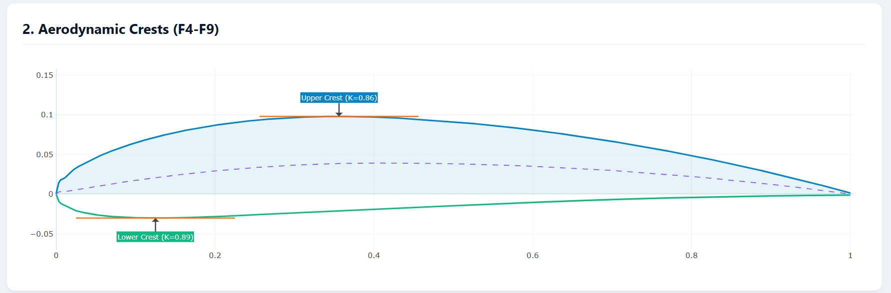
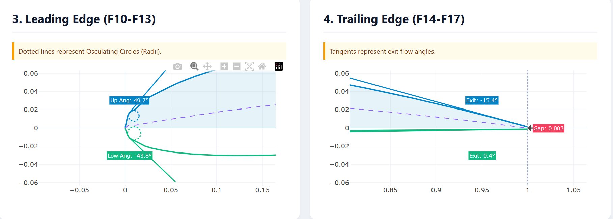
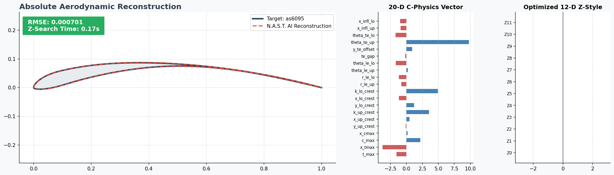
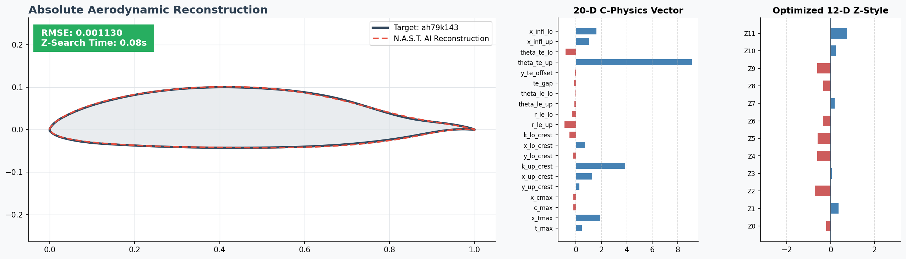
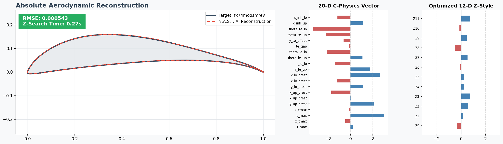
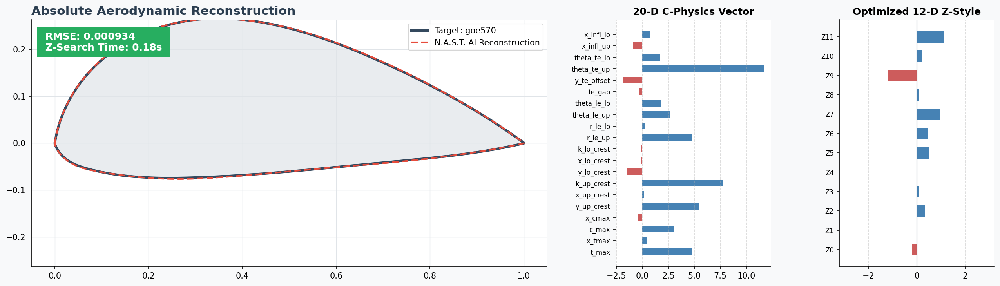

<link rel="stylesheet" href="https://cdnjs.cloudflare.com/ajax/libs/font-awesome/6.4.0/css/all.min.css">

<div align="center">

<h1 style="color: #9370DB; font-size: 3.5em; margin-bottom: 0px;"><i class="fa-solid fa-network-wired"></i> N.A.S.T.</h1>
<p style="color: #708090; font-size: 1.3em; font-style: italic; font-weight: bold; margin-top: 5px;">Neural Aerodynamic Shape Transformation Framework</p>
<div align="center">
  
</div>

<!-- FLEXBOX BADGES (Perfectly Spaced & Formatted) -->
<div style="display: flex; justify-content: center; gap: 12px; margin-top: 15px; margin-bottom: 25px; flex-wrap: wrap;">
  <a href="https://www.python.org/downloads/"></a>
  <a href="https://pytorch.org/"></a>
  <a href="https://onnxruntime.ai/"></a>
  <a href="https://scipy.org/"></a>
  <a href="https://opensource.org/licenses/MIT"></a>
</div>

```text
========================================================================================
       ███╗   ██╗    █████╗    ███████╗   ████████╗
       ████╗  ██║   ██╔══██╗   ██╔════╝   ╚══██╔══╝
       ██╔██╗ ██║   ███████║   ███████╗      ██║   
       ██║╚██╗██║   ██╔══██║   ╚════██║      ██║   
       ██║ ╚████║   ██║  ██║   ███████║      ██║   
       ╚═╝  ╚═══╝   ╚═╝  ╚═╝   ╚══════╝      ╚═╝   
========================================================================================
                 Neural Aerodynamic Shape Transformation | Latent Space Z-Routing
                  Disentangled β-cVAE Engine | Sobolev Physics-Informed Math
                DEVELOPERS: Gamil Abdullah Al-Sharif & Yhya Abdullah Al-Wazir
                               Contact: mely104haja@gmail.com
========================================================================================
```
</div>

---

## <span style="color: #9370DB;"><i class="fa-solid fa-triangle-exclamation"></i> 1. The Crisis of Traditional Parameterization</span>

Historically, aerodynamicists have relied on mathematical polynomials (like **PARSEC**, **Hicks-Henne**, or **Class Shape Transformation - CST**) to define airplane wings. However, polynomials are inherently flawed: **they are mathematically blind to fluid dynamics.**

<div style="display: flex; flex-direction: column; gap: 15px; margin-top: 15px;">

<div style="background-color: #FFF3CD; border-left: 5px solid #FFC107; padding: 15px; border-radius: 6px; color: #856404;">
  <h4 style="margin-top: 0px; margin-bottom: 5px; color: #B8860B;"><i class="fa-solid fa-chart-area"></i> The Exploitation of Polynomials</h4>
  When computational optimization algorithms (like Genetic Algorithms) manipulate polynomial variables to maximize Lift-to-Drag ($L/D$) ratios, they relentlessly exploit mathematical blind spots. This results in <strong>jagged leading edges, crossed boundary lines, and microscopically rippled surfaces</strong> that polynomials technically allow, but physics strictly forbid.
</div>

<div style="background-color: #F8D7DA; border-left: 5px solid #DC3545; padding: 15px; border-radius: 6px; color: #721C24;">
  <h4 style="margin-top: 0px; margin-bottom: 5px; color: #A52A2A;"><i class="fa-solid fa-bomb"></i> The CFD Crash Cascade</h4>
  When these "broken" mathematical geometries are passed to strict CFD solvers (like <strong>XFOIL</strong> or <strong>OpenFOAM</strong>), the meshing algorithms catastrophically fail, returning <code>NaN</code> matrices and entirely destroying the optimization loop.
</div>

</div>

---

## <span style="color: #9370DB;"><i class="fa-solid fa-brain"></i> 2. The N.A.S.T. Solution</span>

**N.A.S.T. abandons polynomials entirely.** 

Powered by a **Physics-Informed Deep Neural Network** trained on a mathematically "healed" database of over 700,000 real-world aerodynamic topologies, the engine *only* knows how to generate viable, aerodynamically sound airplane wings.

Aerodynamicists gain explicit, deterministic control over the wing via a revolutionary **32-Dimensional Parameterization Matrix**:

<div style="display: flex; flex-direction: column; gap: 15px; margin-top: 15px; margin-bottom: 25px;">

  <!-- Constraint 1 -->
  <div style="background-color: #F0F8FF; border: 1px solid #E2E8F0; padding: 15px; border-radius: 6px; border-left: 4px solid #1E90FF;">
    <h4 style="margin-top: 0px; margin-bottom: 10px; color: #1E3A8A;"><i class="fa-solid fa-bone"></i> The Skeleton (20 $C$-Features)</h4>
    <p style="margin-top: 0px; margin-bottom: 0px; font-size: 0.95em; color: #444; line-height: 1.6;">Explicit, real-world physical constraints mapped to direct aeronautical engineering requirements. These include Max Thickness, Leading Edge Radii, Upper/Lower Crest Locations, Trailing Edge Gaps, and Camber profiles.</p>
  </div>

  <!-- Constraint 2 -->
  <div style="background-color: #F3E5F5; border: 1px solid #E1BEE7; padding: 15px; border-radius: 6px; border-left: 4px solid #9C27B0;">
    <h4 style="margin-top: 0px; margin-bottom: 10px; color: #4A148C;"><i class="fa-solid fa-palette"></i> The Style (12 $Z$-Features)</h4>
    <p style="margin-top: 0px; margin-bottom: 0px; font-size: 0.95em; color: #444; line-height: 1.6;">Abstract, multi-dimensional "Latent" variables governing the internal Neural Manifold. These variables control curve tension, mass distribution, and subtle aerodynamic styling <i>between</i> the rigid structural constraints of the Skeleton.</p>
  </div>

</div>

> <i class="fa-solid fa-check-double" style="color: #28A745;"></i> **The Ultimate Output:** A mathematically flawless, $C^2$-continuous coordinate array, generated in milliseconds and strictly prepared for high-performance CFD mesh generation and CNC manufacturing.

---

## <span style="color: #9370DB;"><i class="fa-solid fa-microscope"></i> 3. Visualizing the Engine Capabilities</span>

### <span style="color: #4682B4;">3.1 Constraining the Geometry</span>
<div align="center">
  
  
</div>
<div align="center" style="margin-top: 10px;">
  
  
</div>

### <span style="color: #4682B4; margin-top: 20px; display: inline-block;">3.2 AI Validation Against Real-World Airfoils</span>
<div align="center">
  
  
</div>
<div align="center" style="margin-top: 10px;">
  
  
</div>

---

## <span style="color: #9370DB;"><i class="fa-solid fa-folder-tree"></i> 4. Repository Architecture</span>

The N.A.S.T. framework is organized into a clean, modular hierarchy, strictly isolating the core mathematical inference engine from the documentation and global datasets.

<div style="background-color: #1E1E1E; padding: 15px; border-radius: 8px; border: 1px solid #333; margin-bottom: 20px; box-shadow: 0 4px 15px rgba(0,0,0,0.2);">
  <pre style="margin: 0px; background-color: #1E1E1E; color: #D4D4D4; border: none; font-family: 'Consolas', monospace; font-size: 0.85em; line-height: 1.4; white-space: pre-wrap;"><span style="color: #9CDCFE; font-weight: bold;">NAST_Project/</span>
│
├── <span style="color: #9CDCFE;">NAST_Scr/</span>                       <span style="color: #6A9955;"># Core AI & Mathematical Engine</span>
│   ├── <span style="color: #CE9178;">nast_advanced_gen.py</span>        <span style="color: #6A9955;"># Macro/Micro Synthesis Engine CLI</span>
│   ├── <span style="color: #CE9178;">nast_master_cli.py</span>          <span style="color: #6A9955;"># Unified Inversion & Generation Router</span>
│   ├── <span style="color: #CE9178;">train_nast_infinite.py</span>      <span style="color: #6A9955;"># Automated AI Training Pipeline</span>
│   ├── <span style="color: #4EC9B0; font-weight: bold;">nast_decoder.onnx</span>           <span style="color: #6A9955;"># Compiled Neural Network Brain</span>
│   ├── <span style="color: #4EC9B0; font-weight: bold;">nast_decoder.onnx.data</span>      <span style="color: #6A9955;"># Extended ONNX weight tensors</span>
│   ├── <span style="color: #DCDCAA;">nast_normalization.npz</span>      <span style="color: #6A9955;"># Mathematical normalization matrices</span>
│   └── <span style="color: #C586C0;">NAST_Global_DNA_Library.json</span><span style="color: #6A9955;"># 32-D Math Dictionary of 700k airfoils</span>
│
├── <span style="color: #9CDCFE;">Foil_Folder/</span>                    <span style="color: #6A9955;"># Reference Aerodynamic Data</span>
│   └── <span style="color: #CE9178;">NACA0012.dat</span>                <span style="color: #6A9955;"># Sample target file for AI Inversion</span>
│
├── <span style="color: #9CDCFE;">docs/</span>                           <span style="color: #6A9955;"># Comprehensive Documentation Library</span>
│   ├── <span style="color: #CE9178;">01_Introduction.md</span>          <span style="color: #6A9955;"># Framework Overview & Paradigm shift</span>
│   ├── <span style="color: #CE9178;">02_Advanced_Gen_Examples.md</span> <span style="color: #6A9955;"># Parametric Manipulation CLI guides</span>
│   ├── <span style="color: #CE9178;">03_Master_CLI_Examples.md</span>   <span style="color: #6A9955;"># L-BFGS-B Inversion algorithms</span>
│   ├── <span style="color: #CE9178;">04_Data_Outputs.md</span>          <span style="color: #6A9955;"># XFOIL .dat, CAD .dxf, and CSV exporting</span>
│   └── <span style="color: #CE9178;">05_Theory_and_Math.md</span>       <span style="color: #6A9955;"># The Calculus behind the β-VAE</span>
│
├── <span style="color: #CE9178;">test_cli_suite.py</span>               <span style="color: #6A9955;"># Automated QA Testing Suite</span>
└── <span style="color: #DCDCAA;">requirements.txt</span>                <span style="color: #6A9955;"># Python Dependency Blueprint</span></pre>
</div>

<div style="background-color: #D4EDDA; border-left: 5px solid #28A745; padding: 10px 15px; border-radius: 6px; color: #155724; font-size: 0.9em;">
  <strong><i class="fa-solid fa-shield-check"></i> Automated System Verification:</strong> Run <code>python test_cli_suite.py</code> at any time to trigger the automated QA engineer. It executes 10 complex operations to guarantee parameter overrides, interpolation splines, and export formats function flawlessly on your local hardware.
</div>

---

## <span style="color: #9370DB;"><i class="fa-solid fa-rocket"></i> 5. Quick Start: Hello World</span>

Get N.A.S.T. running locally and generate your first AI-driven airfoil in under 60 seconds.

### <span style="color: #4682B4;"><i class="fa-solid fa-download"></i> Step 1: Installation</span>
Clone the repository and install the highly optimized scientific computing dependencies. *(Using a Virtual Environment is highly recommended)*.
```bash
git clone https://github.com/Gamil-Al-Sharif/NAST_Project.git
cd NAST_Project
pip install -r requirements.txt
```

### <span style="color: #4682B4;"><i class="fa-solid fa-terminal"></i> Step 2: Synthesize Your First Airfoil</span>
Use the Advanced Generator CLI to synthesize a completely novel airfoil. In this command, we will instruct the AI to generate a **15% thick, 4% cambered** wing, mapped onto a **200-point Half-Cosine grid**, instantly exporting it to an XFOIL `.dat` format and a `.png` plot.

```bash
python NAST_Scr/nast_advanced_gen.py --name "Hello_NAST" --output_dir NAST_Output --t_max 0.15 --c_max 0.04 --points 200 --spacing half-cosine --export_selig --export_plot
```

---

## <span style="color: #9370DB;"><i class="fa-solid fa-book"></i> 6. Deep Dive Documentation</span>

To truly master the N.A.S.T. framework, explore our comprehensive Markdown documentation located in the `docs/` folder. It contains over 40 copy-and-paste CLI examples and deep theoretical explanations.

| Module | Description |
| :--- | :--- |
| <i class="fa-solid fa-file-code" style="color: #1E90FF;"></i> [**20+ Examples for `nast_advanced_gen.py`**](docs/02_Advanced_Gen_Examples.md) | *Learn how to synthesize Supersonic Needle-Noses, Thick Heavy-Lifters, and explicitly control Z-Space Latent styling.* |
| <i class="fa-solid fa-copy" style="color: #32CD32;"></i> [**20+ Examples for `nast_master_cli.py`**](docs/03_Master_CLI_Examples.md) | *Learn how to use the L-BFGS-B optimizer to "Clone" real-world airfoils, extract their JSON DNA, and mathematically heal noisy wind-tunnel data.* |
| <i class="fa-solid fa-floppy-disk" style="color: #FF8C00;"></i> [**Data Outputs & Formats Guide**](docs/04_Data_Outputs.md) | *A technical guide to exporting airfoils directly into XFOIL (.dat), Pandas Machine Learning Dataframes (.csv), and SolidWorks/AutoCAD (.dxf).* |
| <i class="fa-solid fa-square-root-variable" style="color: #DC143C;"></i> [**Math Format & $\beta$-VAE Theory**](docs/05_Theory_and_Math.md) | *The rigorous analytical calculus behind the 20-Feature Extractor, and the deep-learning mathematics of the Disentangled KL Divergence loss functions.* |

---


## 👨‍💻 About the Developers

<div align="center">
  <table style="border-collapse: collapse; border: none; width: 100%;">
    <tr>
      <td align="center" width="50%" style="border: none;">
        <h3>Gamil Abdullah Al-Sharif</h3>
        <b>Mechanical Engineer & R&D Specialist</b><br>
        <i>Sana'a, Yemen</i><br><br>
        ✉️ <a href="mailto:mely104haja@gmail.com">mely104haja@gmail.com</a><br>
        💼 <a href="https://linkedin.com/in/gamil-alsharif">LinkedIn Profile</a>
      </td>
      <td align="center" width="50%" style="border: none;">
        <h3>Yhya Abdullah Al-Wazir</h3>
        <b>Mechanical Engineer & R&D Specialist</b><br>
        <i>Sana'a, Yemen</i><br><br>
        ✉️ <a href="mailto:abdullahyhya141@gmail.com">abdullahyhya141@gmail.com</a><br>
        🔬 <a href="https://researchgate.net/profile/Yhya-Abdullah-Al-Waze">ResearchGate Profile</a>
      </td>
    </tr>
  </table>
</div>

<br>

<div align="center">
  <i>Built with passion for the advancement of computational fluid dynamics and aerospace optimization.</i>
</div>
